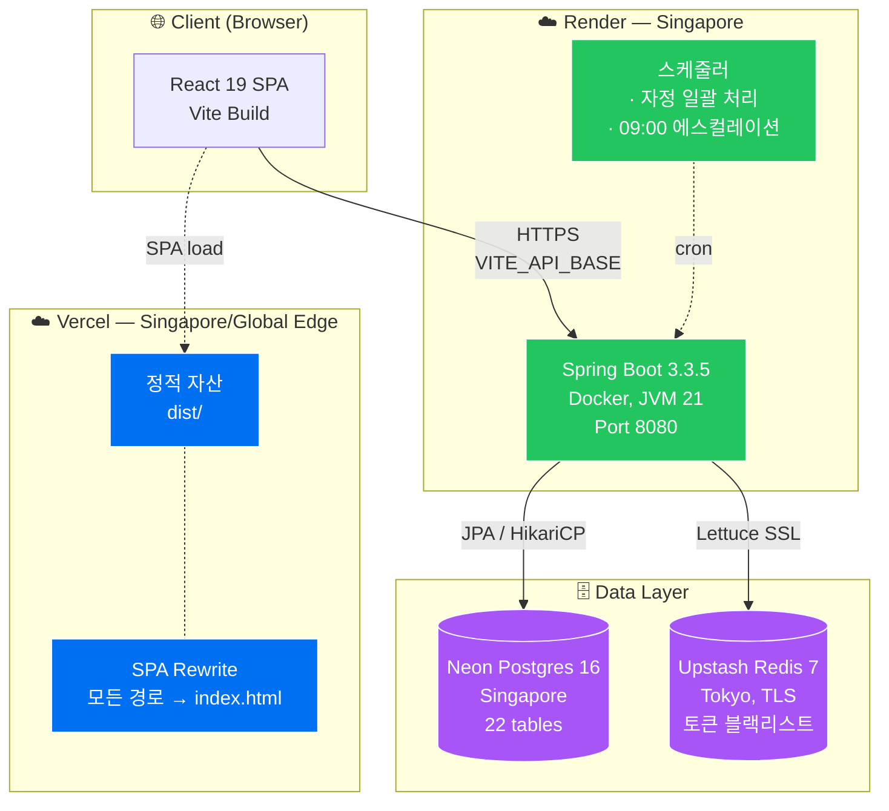
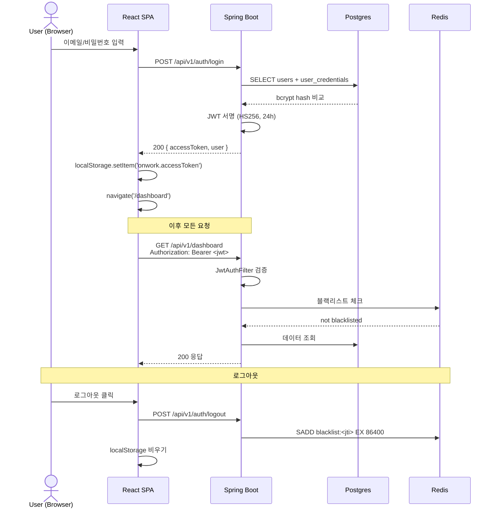
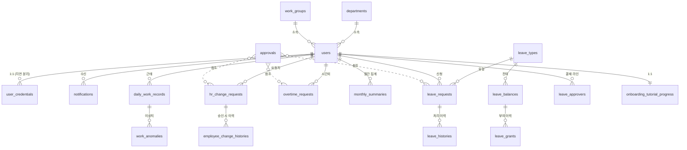
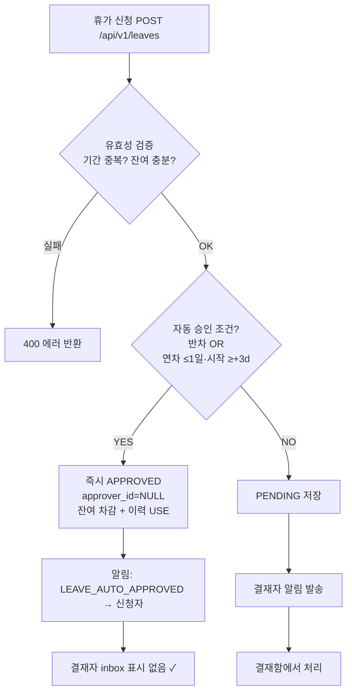
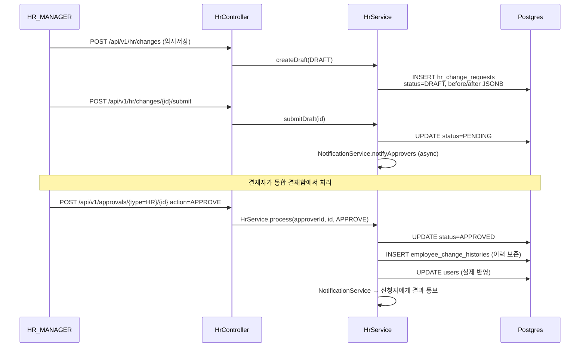
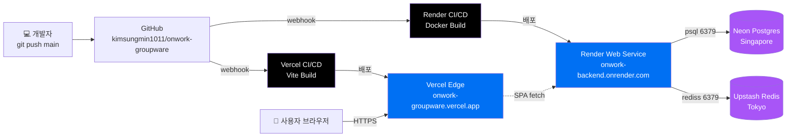

# OnWork — 아키텍처 문서

> **한 줄 요약**: 중소기업용 그룹웨어. 인사·근태·휴가·결재·알림을 한 화면에서 처리하며, 결재자 피로도를 줄이는 5축 자동화(자동승인·일괄·에이징·에스컬레이션·다이제스트)가 차별점.

---

## 1. 시스템 개요

| 항목 | 값 |
|---|---|
| 대상 사용자 | 22명 규모 기업 (CEO 1, VP 1, HR_MANAGER 1, MANAGER 4, EMPLOYEE 15) |
| 핵심 도메인 | 인증 · 인사 · 근태 · 휴가 · 결재 · 알림 · 대시보드 |
| 운영 환경 | Vercel(프론트) + Render(백엔드) + Neon(Postgres) + Upstash(Redis) — 모두 무료 티어 |
| 시연 URL | https://onwork-groupware.vercel.app |
| API Base | https://onwork-backend.onrender.com/api/v1 |

---

## 2. 기술 스택

### Backend
- **Java 21 · Spring Boot 3.3.5** (Gradle, Toolchain)
- **Spring Web · Data JPA · Security · Validation · Data Redis · Actuator**
- **JWT** — jjwt 0.12.6 (Access Token 단일, Bearer)
- **PostgreSQL 16/17** — JSONB 컬럼 + `@JdbcTypeCode`
- **Redis 7** — 토큰 블랙리스트 + 캐시
- **ArchUnit 1.3** — 레이어 경계 자동 검증 (ADR-SYS-001)
- **Lombok**

### Frontend
- **React 19 + TypeScript + Vite**
- **react-router-dom 7** — 단순 SPA 라우팅
- **axios** — `Authorization: Bearer <jwt>` 자동 주입 인터셉터
- ESLint + tsc 빌드

### Infra / DevOps
- **Docker** — 멀티스테이지 빌드 (eclipse-temurin:21-jdk → jre-alpine)
- **docker-compose** — 로컬 Postgres + Redis
- **GitHub** — main 푸시 → Vercel/Render 자동 재배포

---

## 3. 시스템 아키텍처



---

## 4. 백엔드 모듈 구조

`kr.onwork` 패키지 기준. **모듈 = 도메인** 으로 1:1 매핑, 모듈 안에서는 `domain → repository → service → web/dto` 의 4-layer 패턴. ArchUnit이 레이어 경계를 자동 검증.

```
kr.onwork/
├── common/              공통 — Security, JWT, CORS, GlobalException, Audit
│   ├── config/          SecurityConfig, JwtConfig, JpaConfig, CacheConfig
│   ├── security/        JwtAuthFilter, JpaUserDetailsService, PrincipalUser
│   ├── error/           GlobalExceptionHandler, ErrorCode, ApiError
│   ├── domain/          공통 엔티티 (BaseTimeEntity 등)
│   ├── repository/      공통 base
│   └── web/             공통 ResponseAdvice
│
├── auth/                인증 (UC-AUTH)
│   ├── service/         AuthService — login/logout/refresh
│   ├── web/             AuthController — /auth/login, /auth/logout, /auth/me
│   └── dto/             LoginRequest, TokenResponse
│
├── hr/                  인사 (UC-HR-01~04) — 결재 → 적용 패턴
│   ├── domain/          HrChangeRequest(JSONB before/after), EmployeeChangeHistory, RequestStatus(DRAFT/PENDING/...)
│   ├── repository/      HrChangeRequestRepository
│   ├── service/         HrService — 임시저장, 신규입사, 변경(직급/부서/연봉), 퇴사(soft delete)
│   ├── web/             HrController
│   └── dto/             HrChangeCreateReq, HrChangeResponse 등
│
├── attendance/          근태 (UC-ATT)
│   ├── domain/          DailyWorkRecord, OvertimeRequest, WorkAnomaly, MonthlyDigest
│   ├── repository/      *Repository
│   ├── scheduler/       MidnightBatchScheduler (ADR-ATT-001)
│   ├── service/         AttendanceService, OvertimeService
│   ├── web/             AttendanceController
│   └── dto/             ...
│
├── leave/               휴가 (UC-LEAVE-01~04)
│   ├── domain/          LeaveRequest, LeaveBalance, LeaveType, LeaveHistory, LeaveApprover
│   ├── repository/      *Repository
│   ├── service/         LeaveService — 자동승인 분기 포함 (개선 1)
│   ├── web/             LeaveController
│   └── dto/             ...
│
├── approval/            통합 결재함 + 일괄/에이징 (Painpoint 개선)
│   ├── domain/          ApprovalItem(type 무관 통합)
│   ├── service/         ApprovalService — inbox 통합 + 정렬(에이징) + batchProcess
│   ├── scheduler/       EscalationScheduler (09:00 cron, 개선 4)
│   ├── web/             ApprovalController — /approvals, /approvals/batch, /approvals/admin/escalate
│   └── dto/             BatchProcessRequest/Response, ApprovalItem(ageDays, urgent)
│
├── notification/        알림 (UC-NOTIF)
│   ├── domain/          Notification (type enum)
│   ├── repository/      NotificationRepository
│   ├── service/         NotificationService — 발송, unreadCount, digest (개선 5)
│   ├── web/             NotificationController — /notifications, /notifications/digest
│   └── dto/             NotificationDigest 등
│
├── dashboard/           홈 위젯
│   ├── service/         DashboardService — 위젯 5종 집계
│   ├── web/             DashboardController
│   └── dto/             DashboardWidgets
│
└── onboarding/          신규입사 튜토리얼 진행 상태
    ├── domain/          OnboardingTutorialProgress
    ├── repository/
    ├── service/
    └── web/
```

### 의존 방향 (ArchUnit이 검증)

```
web ───▶ service ───▶ repository ───▶ domain
                            ▲
                            └── domain (단일 의존)
```

- `web` 은 `service` 만 호출, 절대 `repository` 직접 호출 X
- `domain` 은 어디에도 의존 X (POJO)
- 모듈 간 호출은 **service → service** 로만 (예: `LeaveService` 가 `NotificationService` 호출 OK, 그러나 `repository` 침범은 차단)

---

## 5. 프론트엔드 구조

```
frontend/src/
├── App.tsx              라우터 + 인증 가드
├── main.tsx             엔트리
├── components/
│   └── AppLayout.tsx    사이드바 + 헤더(알림 벨 드롭다운: 다이제스트 표시)
├── pages/
│   ├── LoginPage.tsx       /login
│   ├── DashboardPage.tsx   /dashboard — 위젯 5종
│   ├── HrPage.tsx          /hr — 신규입사 폼 + 임시저장(DRAFT)
│   ├── AttendancePage.tsx  /attendance — 출퇴근, 시간외, 월간
│   ├── LeavePage.tsx       /leave — 휴가 신청 + 잔여
│   └── ApprovalsPage.tsx   /approvals — 통합 결재함(체크박스 일괄 처리)
├── lib/
│   └── api.ts           axios 인스턴스 + Bearer 인터셉터
├── styles/
│   └── index.css        디자인 토큰 + 배지 클래스
└── vite.config.ts
```

**라우팅 가드**: `App.tsx` 가 `localStorage.onwork.accessToken` 존재 여부로 `/login` 리디렉트. 토큰 만료 시 axios 인터셉터에서 401 → `/login`.

---

## 6. 인증 흐름 (JWT, ADR-SYS-002)



---

## 7. 데이터 모델

총 22 테이블, 6 도메인 그룹.



### 도메인 그룹별 테이블

| 그룹 | 테이블 |
|---|---|
| 조직 | `users`, `user_credentials`, `departments`, `work_groups` |
| 인사 | `hr_change_requests`(JSONB before/after), `employee_change_histories` |
| 근태 | `daily_work_records`, `overtime_requests`, `work_anomalies`, `monthly_summaries`, `attendance_settings` |
| 휴가 | `leave_types`, `leave_settings`, `leave_approvers`, `leave_balances`, `leave_grants`, `leave_requests`, `leave_histories` |
| 결재/알림 | `approvals`(공용 메타), `notifications` |
| 온보딩 | `onboarding_tutorial_progress` |

### 핵심 설계 결정

- **JSONB before/after** (`hr_change_requests`) — 인사 변경의 어떤 필드든 동일 컬럼으로 저장 → 스키마 변경 없이 신규 항목 추가 가능
- **Soft delete** (퇴사, ADR-HR-003) — `users.is_active=false` + `resigned_at` 채움, 데이터 보존
- **결재 → 적용 분리** (ADR-HR-001) — 모든 변경은 `hr_change_requests` 거쳐서 승인되어야 `employee_change_histories` 에 이력 + `users` 반영
- **휴가 대행 결재** (ADR-003) — `leave_approvers.is_absent=true` 면 라우팅에서 제외, 다음 순위가 대행

---

## 8. 핵심 도메인 흐름

### 8.1 휴가 신청 (자동 승인 분기 — 개선 1)



### 8.2 통합 결재함 + 일괄 처리 (개선 2+3)

```mermaid
flowchart LR
    subgraph Input
        A[휴가 PENDING]
        B[시간외 PENDING]
        C[인사 PENDING]
    end
    Input --> M{ApprovalService.inbox<br/>역할 범위 필터링<br/>+ 자기승인 차단}
    M --> N[ApprovalItem 통합<br/>type, id, requester,<br/>ageDays, urgent]
    N --> O{정렬<br/>urgent DESC,<br/>ageDays DESC}
    O --> P[프론트 ApprovalsPage<br/>체크박스 + 긴급 배지]
    P -->|선택 N개 + 승인| Q[POST /approvals/batch]
    Q --> R{타입별 위임<br/>·LEAVE → LeaveService<br/>·OVERTIME → AttendanceService<br/>·HR → HrService}
    R --> S[건별 독립 트랜잭션<br/>1건 실패 ≠ 전체 실패]
    S --> T[{ total, succeeded, failed, results[] }]
```

### 8.3 자동 에스컬레이션 (개선 4) — 매일 09:00 KST

```
@Scheduled(cron="0 0 9 * * *", zone="Asia/Seoul")
EscalationScheduler.run()
  ├─ LeaveRequestRepository.findByStatusAndCreatedAtBefore(now-3d)
  ├─ HrChangeRequestRepository.findByStatusAndCreatedAtBefore(now-3d)
  └─ OvertimeRequestRepository.findByStatusAndCreatedAtBefore(now-3d)
       └─ 각 항목의 현재 유효 결재자 산정 (휴가 대행 반영)
            └─ NotificationService.send(APPROVAL_LONG_PENDING, "장기 대기 결재 N건")
```

### 8.4 알림 다이제스트 (개선 5)

```
GET /api/v1/notifications/digest
{
  "unread": 5,            // unreadCount
  "pendingApprovals": 3,  // ApprovalService.inbox 카운트
  "longPending": 1,       // urgent(2일+) 카운트
  "recentApproved": 2,    // 최근 처리된 결재
  "recentItems": [...]    // 상위 5건 알림 본문
}
```

프론트 헤더 알림 벨 클릭 시 한번에 표시. 풀 페이지 없이도 “해야 할 일 N건” 파악.

### 8.5 인사 변경 (결재 → 적용, ADR-HR-001)



---

## 9. 권한 모델 (RBAC, 5단계 계층)

```
CEO ─▶ VP ─▶ HR_MANAGER ─▶ MANAGER ─▶ EMPLOYEE
       └────────────── 모두 자신 + 하위만 조회 가능 (자기보다 위는 X)
```

| 역할 | 주요 권한 |
|---|---|
| EMPLOYEE | 자기 근태/휴가 신청·조회, 본인 정보 수정 요청 |
| MANAGER | 팀원의 휴가/시간외 1차 결재, 팀 근태 조회 |
| HR_MANAGER | 인사 변경 신청 권한, 직원 정보 관리 |
| VP | HR 결재 + 회사 전체 근태/휴가 조회 |
| CEO | 모든 권한 + `/admin/*` (수동 트리거: 결재 에스컬레이션, 근태 이상 감지) |

`PrincipalUser` (Spring Security `Authentication.principal`) 에 `role`, `departmentId`, `userId` 보유 → 서비스에서 권한 분기.

---

## 10. 배포 아키텍처



### 환경변수 (운영)

**Render (Backend)**
```
SPRING_DATASOURCE_URL=jdbc:postgresql://...neon.tech/onwork?sslmode=require
SPRING_DATASOURCE_USERNAME=...
SPRING_DATASOURCE_PASSWORD=...
SPRING_DATA_REDIS_HOST=...upstash.io
SPRING_DATA_REDIS_PORT=6379
SPRING_DATA_REDIS_PASSWORD=...
SPRING_DATA_REDIS_SSL_ENABLED=true
ONWORK_JWT_SECRET=<openssl rand -base64 48>
ONWORK_CORS_ORIGINS=https://onwork-groupware.vercel.app,...
```

**Vercel (Frontend)**
```
VITE_API_BASE=https://onwork-backend.onrender.com/api/v1
```

### 한계 (무료 티어)
- **Render Free**: 15분 미요청 시 슬립 → 콜드 스타트 ~30초 (시연 직전 ping 권장)
- **Neon Free**: 0.5GB 스토리지, 컴퓨트는 5분 idle 후 suspend
- **Upstash Free**: 256MB, 10k command/day

상세 배포 가이드: [`DEPLOY.md`](./DEPLOY.md)

---

## 11. 결재 피로도 5축 개선 (Painpoint 대응)

교수님 지적: *"팀장이나 CEO 등에게 결재가 쌓여 피로도가 올라간다."*

| # | 축 | 구현 | 효과 |
|---|---|---|---|
| 1 | **자동 승인** | 반차 + 연차 ≤1일(시작일 +3d) → `LeaveService` 분기, `status=APPROVED, approver_id=null` | 결재 건수 자체 ↓ |
| 2 | **일괄 처리** | `POST /approvals/batch` — 체크박스로 N건 한번에 승인/반려, 건별 독립 트랜잭션 | 클릭 N→1 |
| 3 | **에이징/긴급도** | `ApprovalItem.ageDays/urgent` + 정렬 `urgent DESC, ageDays DESC`, 빨강 배지 ≥2일 | 오래된 것부터 시선 유도 |
| 4 | **자동 에스컬레이션** | `EscalationScheduler` 매일 09:00, 3일+ PENDING 결재자에게 `APPROVAL_LONG_PENDING` 알림 | 방치 방지 |
| 5 | **알림 다이제스트** | `GET /notifications/digest` — 1회 호출 = 5지표, 헤더 벨 드롭다운 | 이벤트 폭주 → 요약 |

---

## 12. 디렉토리 구조 (Top-level)

```
onwork/
├── backend/                  Spring Boot 백엔드
│   ├── Dockerfile            멀티스테이지 (jdk21 → jre-alpine)
│   ├── build.gradle
│   └── src/
│       ├── main/java/kr/onwork/   8개 도메인 모듈
│       └── test/java/kr/onwork/   ArchUnit + 단위 테스트
│
├── frontend/                 React + Vite SPA
│   ├── vercel.json           SPA rewrite + Vite framework
│   ├── package.json
│   └── src/
│       ├── pages/            7 페이지 (Login, Dashboard, Hr, Attendance, Leave, Approvals)
│       ├── components/       AppLayout
│       └── lib/api.ts        axios + Bearer
│
├── db/                       SQL
│   ├── schema.sql            22 테이블 + CHECK constraints + index
│   ├── seed.sql              22명 사용자 + 부서 + 잔여
│   ├── demo_seed.sql         시연용 PENDING 결재 + 알림
│   └── init.sql              \\i schema + seed + demo (운영 1회 적용)
│
├── docs/                     설계 문서
├── design/                   화면 디자인 메모
├── usecases/                 유스케이스 정의 (UC-AUTH/HR/ATT/LEAVE/NOTIF)
├── workflows/                업무 흐름도
├── memory-bank/              구현 의사결정 기록
│
├── docker-compose.yml        로컬 Postgres + Redis
├── ARCHITECTURE.md           ← 이 문서
├── DEPLOY.md                 Vercel + Render + Neon + Upstash 가이드
├── README.md                 빠른 시작
├── AGENTS.md                 / CLAUDE.md  AI 협업 컨벤션
└── plan.md                   초기 플랜
```

---

## 13. 핵심 ADR (설계 결정 기록)

| ADR | 결정 |
|---|---|
| **SYS-001** | 헥사고날 변종 → web/service/repository/domain 4-layer, ArchUnit 강제 |
| **SYS-002** | 인증은 JWT Bearer 단일 (세션 X). 블랙리스트는 Redis SET, JTI 기반 |
| **SYS-003** | 시각 처리는 항상 `Asia/Seoul`. DB는 `TIMESTAMP` (timezone naive) + 서버 TZ 설정 |
| **HR-001** | 인사 변경은 **결재 → 적용** 두 단계. `hr_change_requests` 승인 시만 `users` 반영 |
| **HR-003** | 퇴사는 soft delete: `is_active=false` + `resigned_at`, 데이터 보존 |
| **ATT-001** | 자정(00:05) 배치 — 미체크아웃 자동 마감 + 일근태 집계 |
| **LEAVE-003** | 휴가 결재자 부재 시 `leave_approvers.is_absent=true` 에 따라 다음 순위로 라우팅 |

---

## 14. 빠른 시작

### 로컬 개발

```bash
# 1. 인프라 띄우기
docker compose up -d

# 2. 백엔드
cd backend && ./gradlew bootRun
# → http://localhost:8080

# 3. 프론트
cd frontend && npm install && npm run dev
# → http://localhost:5173
```

### 운영 배포

[`DEPLOY.md`](./DEPLOY.md) 참고 — Neon → Upstash → Render → Vercel 순서로 무료 티어로 한 학기 시연 충분.

### 시연 계정

| 이메일 | 역할 | 비밀번호 |
|---|---|---|
| `daehan@onwork.kr` | CEO | `onwork1234!` |
| `hyunjun@onwork.kr` | MANAGER | `onwork1234!` |
| `haeun@onwork.kr` | EMPLOYEE | `onwork1234!` |

(전체 22명 동일 비밀번호 — 시연 편의)

---

## 15. 검증

```bash
# 백엔드 전체 테스트 (ArchUnit 레이어 검증 포함)
cd backend && ./gradlew test

# 프론트 빌드 (TS 타입 체크 포함)
cd frontend && npm run build
```

### E2E 시나리오
1. `daehan` 로그인 → 대시보드 위젯 5종 표시 확인
2. `결재함` → 7건 대기 + 🔴긴급 3건 정렬 확인 → 3건 체크 → "선택 승인" → 토스트 succeeded=3
3. `haeun` 로그인 → 반차 신청 → 즉시 APPROVED + 잔여 차감 + `LEAVE_AUTO_APPROVED` 알림 (자동 승인 분기)
4. `POST /api/v1/approvals/admin/escalate` (CEO 토큰) → 3일+ 결재자에게 `APPROVAL_LONG_PENDING` 알림 발송
5. `GET /api/v1/notifications/digest` → 5지표 JSON 수신
